# 슬라이드 아웃라인 (9장 + 백업) — 기말 발표

> 발표력 30점 = 쉽게 전달. 장표는 글 줄이고 그림/표 위주. 한 장에 메시지 하나.
> 스크립트(`2026-06-09-final-script.md`)와 1:1 대응.

---

## 슬라이드 1 — 타이틀
- 제목: **"보험 시스템 — AI로 만들고, AI를 통제하다"**
- 부제: 설계는 사람, 구현은 AI, 통제의 증거는 git
- 발표자/날짜

## 슬라이드 2 — 도메인 한눈에 (그림)
- 가로 흐름도: `상품 조회 → 가입 신청 → 직원 심사 → 계약 자동생성 → 납입` / 아래 가지: `청구·사고 접수 → 보상 심사 → 지급`
- 액터 3 아이콘: 고객 / 보험사 직원 / 시스템(자동)
- 한 줄: "의료·자동차보험 가입~청구~지급"

## 슬라이드 3 — DEMO (전환용)
- 큰 글씨 "DEMO" + 데모할 흐름 한 줄: "가입 신청 → 조건부 승인+할증 → 계약 자동생성 → 납입"
- (화면 공유로 전환)

## 슬라이드 4 — "데모는 됩니다. 본론은 통제입니다."
- 한 문장만 큼직하게.

## 슬라이드 5 — 4단계 진화 타임라인 (그림)
```
[1] TUI            [2] +DB(distribution)     [3] 웹/분산        [4] Spring(insurance)
 Scanner            Scanner + JDBC/DAO         REST 도입          @RestController
 도메인만           UC핸들러→AppData→DAO→DB    분산 단계화         Controller→Service
 Main 1800줄        ORM 없음                                       →Repository(JPA)
 컨트롤러X                                                          println 도메인에 0개
   8720dfa            (~/Desktop/distribution)                       af491b0 → Epic0~4
   ───────────── 설계(클래스/UC 다이어그램)는 전부 사람이 ─────────────
```
- 핵심 메시지: "단계가 바뀌어도 도메인 모델은 안 흔들림"

## 슬라이드 6 — 통제 메커니즘 + 레이어 패턴 (그림)

```mermaid
flowchart LR
  W[웹 화면] -->|1:1| C[Controller]
  C --> S[Service]
  S --> D[Domain 모델/규칙]
  S --> R[Repository]
  R --> DB[(DB)]
  D -. Entity .-> DTO[Response DTO · from&#40;entity&#41;]
  DTO --> C
```

- 네 가지 통제 장치 불릿: 일정한 레이어 패턴 / CONTEXT.md 용어집 / ADR 9개 / TDD 게이트
- 증거 배지: "도메인 `System.out` = 0 (grep)"

## 슬라이드 7 — 다이어그램 ↔ 코드 1:1 (표) ★가장 강력
| 변경 | 코드 | 결정 근거 |
|---|---|---|
| ClaimStatus +COMPLETED/FAILED | enum 6값 | ADR 0007 |
| ApplicationStatus +CANCELLED | enum 4값 | 취소 흐름 |
| 지급심사 대상 = Claim(추상) | 자동차사고도 진입 | ADR 0009 |
| 배정: 복잡의료=자동 / 자동차=수동 | 서비스 분기 | `206bf25` |
| AccidentRecord 미보유 | 집계값 갈음 | 단순화 |
- 한 줄: "AI가 멋대로 바꾼 게 아니라, 내가 결정 → 문서가 따라옴"

## 슬라이드 8 — 단점: AI가 못한 것 → 잡은 법 ★클라이맥스
- 2열(증상 → 통제) 카드 4개:
  1. 성급한 추상화 → `3fc0ce3` 분리 → `3e57d68` **Revert**
  2. UC와 어긋난 자동배정(`bd2d7ce`) → **수동 정정**(`206bf25`)
  3. 레이어 일탈 `ProfileController` → 점검으로 발견(정직)
  4. 용어 표류·도메인 오염 → 용어집·ADR로 사전 차단
- 한 줄: "AI는 빠르지만 방향은 못 잡는다. 방향은 사람의 게이트가 잡는다."

## 슬라이드 9 — 마무리
- "AI는 통제 가능하다 — 설계·용어집·ADR·TDD가 사람 손에 있을 때만."
- "git 히스토리 = 통제의 로그"

---

## 백업 슬라이드 (질문용, 평소엔 숨김)
- B1. distribution(JDBC DAO `map(ResultSet)`) vs insurance(JPA Entity) 비교 표
- B2. Entity→DTO `from()` 코드 한 조각
- B3. ADR 목록 9개 한 줄 요약
- B4. 폴더 구조(도메인별 controller/service/domain/repository/dto)
