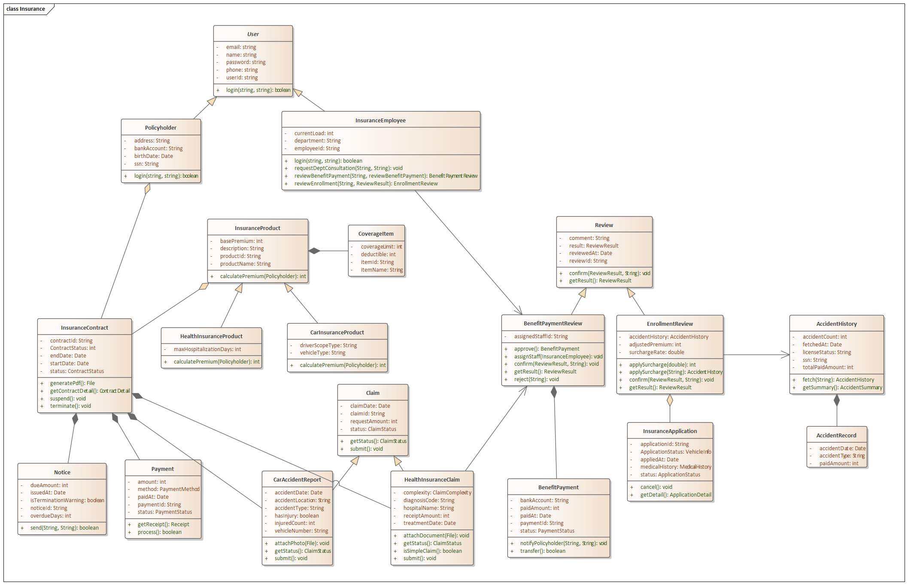
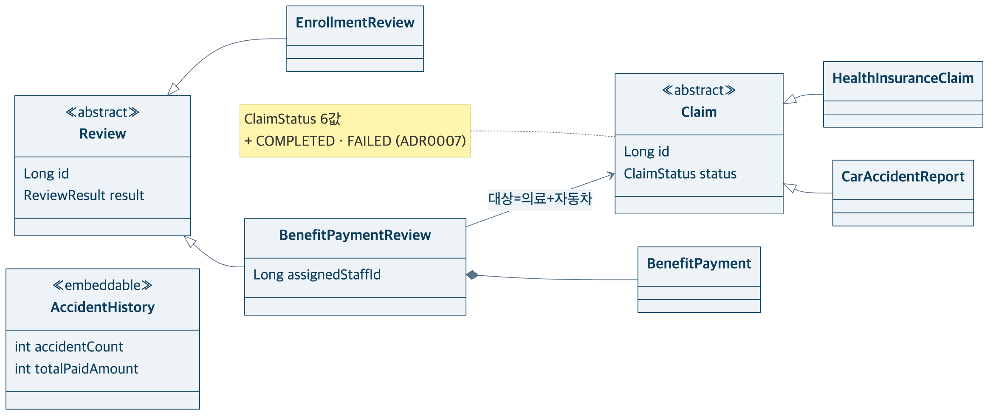
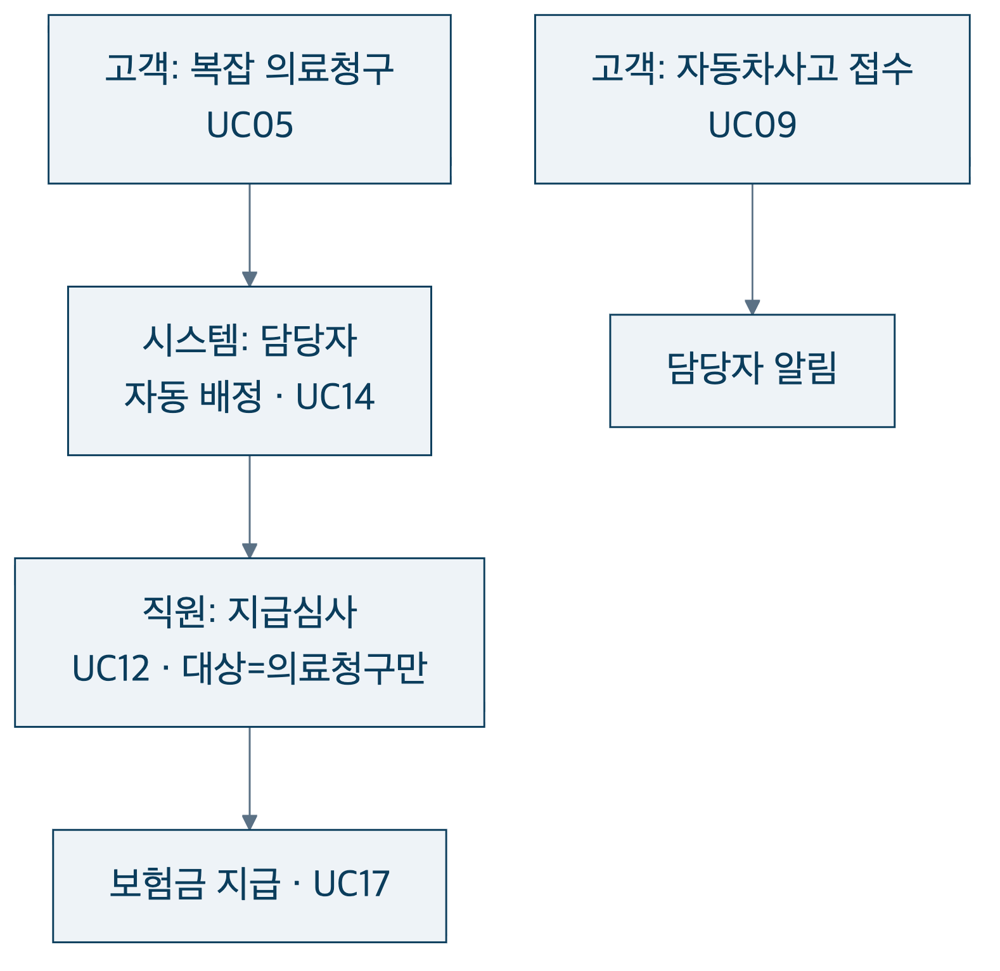
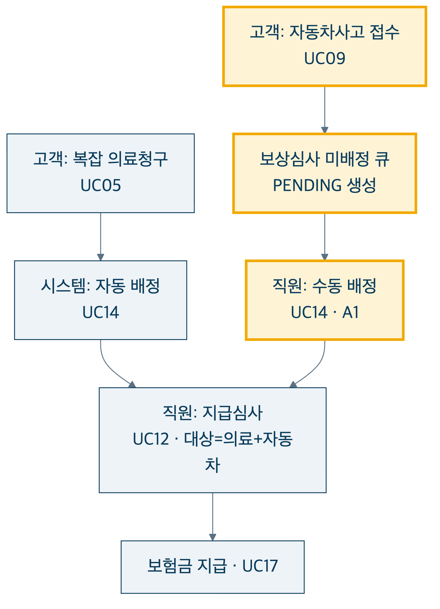

<!-- _class: lead -->
<!-- _paginate: false -->

# 설계대로 구현하고, AI를 통제하다

## 의료·자동차 보험 시스템

 

분산프로그래밍 기말 발표

---

## 무엇을 만들었나 — 한눈에

  
상품 조회<small>고객</small>

  
→

  
가입 신청<small>고객</small>

  
→

  
가입 심사<small>직원</small>

  
→

  
계약 자동생성<small>시스템</small>

  
→

  
납입<small>고객</small>

  
청구·사고 접수<small>고객</small>

  
→

  
보상 심사<small>직원</small>

  
→

  
보험금 지급<small>시스템</small>

**의료·자동차보험**의 가입부터 청구·지급까지. 액터는 셋 — 고객 · 보험사 직원 · 시스템.
클래스·유스케이스 다이어그램은 직접 설계하고, 구현은 AI로 진행했습니다.

---

## 설계안 — 직접 설계한 클래스 다이어그램

  

Enterprise Architect로 직접 작성한 도메인 모델. 이 다이어그램을 <b>AI 구현의 단일 입력</b>으로 사용했습니다.

---

## 설계 → 구현, 무엇이 바뀌었나

보상 심사 영역(변경 집중 구역)

| 변경 | 근거 |
|---|---|
| 지급심사 대상: 의료청구 → **Claim**(의료+자동차) | ADR 0009 |
| ClaimStatus: 4값 → **+COMPLETED·FAILED** | ADR 0007 |
| AccidentRecord 제거 → 집계값으로 단순화 | 설계 단순화 |
| 식별자 String → **Long**, Date → LocalDate | JPA 매핑 |
| VehicleInfo·AutoDebit 등 **@Embeddable** 도입 | JPA 매핑 |

**구조(상속·관계)는 보존**, 변경은 전부 **ADR로 기록** 후 다이어그램에 역반영했습니다.

---

## 설계안 vs 구현 — 유스케이스 (보상 흐름)

  <figure>설계안 (최초)</figure>
  <figure>구현 (데모와 일치)</figure>

**자동차사고**가 보상심사 큐로 진입하고(UC09), 배정이 **자동→수동으로 분기**되며(UC14), 지급심사 대상이 **의료+자동차로 확대**(UC12)되었습니다.

---

## 데이터는 어떻게 흐르는가 — 한눈에

  
FE화면<small>입력·렌더</small>

  
→

  
FEAPI client<small>JSON 직렬화</small>

  
→

  
BEController<small>DTO</small>

  
→

  
BEService·Domain<small>규칙</small>

  
→

  
BERepository

  
→

  
DB

- 같은 정보가 계층 경계마다 **정해진 한 곳에서만** 형태를 바꿉니다: 폼 → JSON → 요청 DTO → 도메인 객체 → DB, 그리고 역순으로 응답 DTO → 화면.
- **핵심 예시**: 직원이 입력한 *할증률* 하나가 도메인 규칙을 거쳐 **계약의 월 보험료**로 기록됩니다. 화면 표시가 아니라 상태 변화입니다.
- 덕분에 **도메인 모델은 웹·DB 어느 쪽에도 오염되지 않습니다** (응답 DTO가 엔티티를 격리).

---

## AI를 어떻게 썼는가

  
<b>사람(설계자)</b> 유스케이스·클래스 다이어그램 · 단계적 진화 전략 · 되돌리기 어려운 결정(ADR) · 리뷰

  
<b>AI</b> 다이어그램을 입력으로 받은 구현 · 테스트 작성 · 리팩토링

  
<b>발산</b><small>아이디어·설계</small>

  
→

  
<b>취조</b><small>도메인 모델 대조</small>

  
→

  
<b>계획</b><small>단계별 작업</small>

  
→

  
<b>TDD 구현</b><small>실패 테스트 우선</small>

  
→

  
<b>교차 리뷰</b><small>명세·품질</small>

진화도 한 번에 가지 않고 **TUI → DB → 웹 → Spring** 4단계로 통제했습니다.
통제 장치: **다이어그램(설계) · 용어집 · ADR · TDD.** AI는 구현을 가속했고, 방향은 사람이 정했습니다.

---

## AI를 쓰며 생긴 문제와 해결

  

    <h3>① 성급한 추상화</h3>
    
DB 도입 전부터 계층을 과하게 분리

    
→ 실익 없어 되돌리고, 진화 단계에 맞춰 재도입

  

  

    <h3>② 유스케이스와 불일치</h3>
    
자동차 보상심사를 자동 배정으로 구현

    
→ 명세 대조(취조)로 발견, 수동 배정으로 정정

  

  

    <h3>③ 계층 패턴 일탈</h3>
    
일부 컨트롤러가 저장소를 직접 호출

    
→ 전 도메인 패턴 점검으로 식별·관리

  

  

    <h3>④ 용어·도메인 오염</h3>
    
동의어 혼용, 도메인에 출력 코드 삽입 경향

    
→ 용어집·ADR로 사전 차단 (도메인 출력 0)

  

**AI는 빠르지만 방향은 못 잡습니다. 방향은 사람이 만든 게이트가 잡습니다.**

---

<!-- _class: lead -->

# 결론

 

- 직접 설계한 **다이어그램이 데모(구현)와 일치**합니다. 벗어난 지점은 ADR로 통제했습니다.
- 데이터는 **명확한 계층 경계에서만** 형태를 바꾸며 도메인은 오염되지 않습니다.
- **AI는 구현을 가속**했고, **설계·결정·검증은 사람이** 통제했습니다.

 

감사합니다. 질문 받겠습니다.
