<!-- _class: lead -->
<!-- _paginate: false -->

# 설계대로 구현하고, AI를 통제하다

## 의료·자동차 보험 시스템

---

## 의료보험

<div class="bigcards" style="grid-template-columns:1fr">
  <div class="bigcard">
    <h3>진료비를 청구하는 보험</h3>
    <p>입원·통원 진료비를 보장합니다.</p>
    <p>보장 한도와 자기부담금이 있습니다.</p>
    <p>청구가 간단하면 즉시 지급, 복잡하면 직원 심사로 넘어갑니다.</p>
  </div>
</div>

---

## 자동차보험

<div class="bigcards" style="grid-template-columns:1fr">
  <div class="bigcard amber">
    <h3>사고를 접수하는 보험</h3>
    <p>차량 정보·운전자 범위·사고 이력으로 보험료를 산정합니다.</p>
    <p>사고가 나면 접수합니다.</p>
    <p>접수되면 담당 직원이 지급액을 사정합니다.</p>
  </div>
</div>

---

## 세 주체가 참여한다

<div class="bigcards three">
  <div class="bigcard"><h3>고객</h3><p>가입·납부·청구·사고접수</p></div>
  <div class="bigcard"><h3>보험사 직원</h3><p>가입 심사·지급 심사</p></div>
  <div class="bigcard amber"><h3>시스템</h3><p>계약 생성·고지서·지급</p></div>
</div>

---

## 여정 ① — 가입

<div class="legend"><span class="lc">고객</span><span class="ls">직원</span><span class="ly">시스템</span></div>

<div class="flow">
  <div class="node cust">상품 조회</div>
  <div class="arrow">→</div>
  <div class="node cust">가입 신청</div>
  <div class="arrow">→</div>
  <div class="node staff">가입 심사</div>
  <div class="arrow">→</div>
  <div class="node sys">계약 자동 생성</div>
</div>

<p class="verdict">심사가 승인되면 계약이 자동으로 만들어집니다.</p>

---

## 여정 ② — 납부와 미납

<div class="legend"><span class="lc">고객</span><span class="ly">시스템</span></div>

<div class="flow">
  <div class="node cust">매달 보험료 납부</div>
  <div class="arrow">→</div>
  <div class="node sys">미납 감지</div>
  <div class="arrow">→</div>
  <div class="node sys">고지서 자동 발송</div>
</div>

<p class="verdict">납부가 밀리면 시스템이 고지서를 자동으로 보냅니다.</p>

---

## 여정 ③ — 보상과 지급

<div class="legend"><span class="lc">고객</span><span class="ls">직원</span><span class="ly">시스템</span></div>

<div class="flow">
  <div class="node cust">청구·사고 접수</div>
  <div class="arrow">→</div>
  <div class="node staff">보상 심사</div>
  <div class="arrow">→</div>
  <div class="node sys">보험금 지급</div>
</div>

<p class="verdict">심사를 거쳐 보험금이 지급됩니다.</p>

---

## 다섯 개의 도메인으로 설계했다

<div class="legend" style="flex-wrap:wrap">
  <span class="ly">사용자</span><span class="ly">상품</span><span class="ly">계약·납부</span><span class="ly">청구·사고</span><span class="ly">심사·지급</span>
</div>

<p class="verdict">이 도메인들을 직접 클래스 다이어그램으로 설계하고, 구현은 AI가 했습니다.</p>

---

## 설계 = 구현 — 사용자

<div class="cmp2">
  <figure><span class="cap cap-d">내가 설계</span>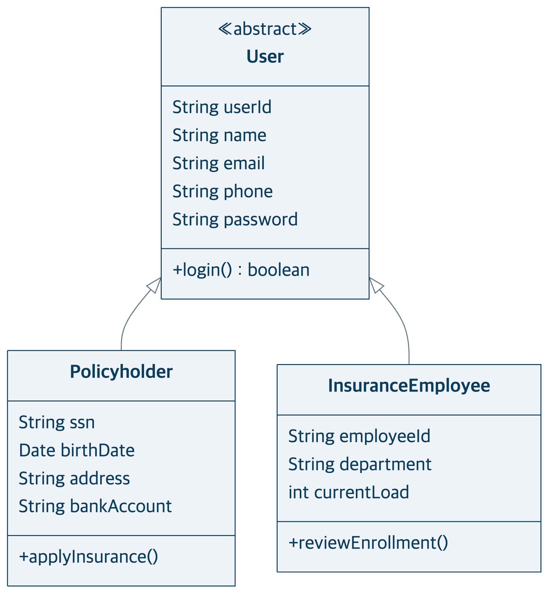</figure>
  <figure><span class="cap cap-b">코드 역설계</span>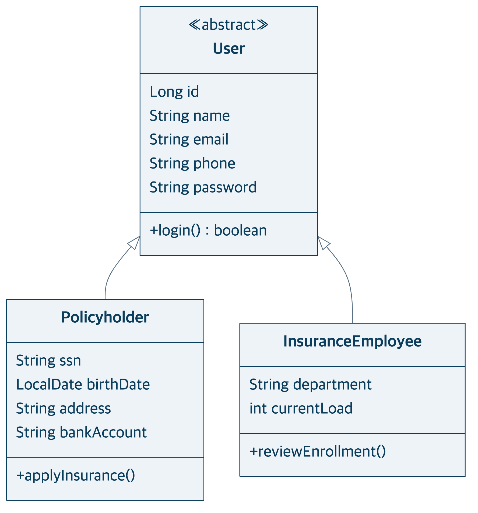</figure>
</div>

<div class="sd">
  <div class="same"><b>같은 점</b> 상속(User→Policyholder·Employee)과 모든 필드가 동일.</div>
  <div class="diff"><b>다른 점</b> userId(String) → id(Long), birthDate Date → LocalDate.</div>
</div>

---

## 설계 = 구현 — 상품

<div class="cmp2">
  <figure><span class="cap cap-d">내가 설계</span>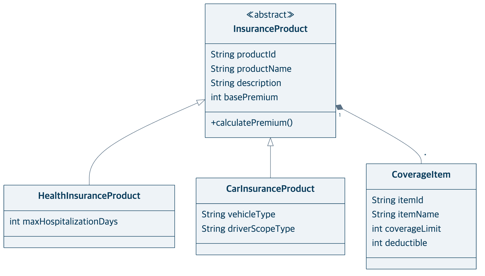</figure>
  <figure><span class="cap cap-b">코드 역설계</span>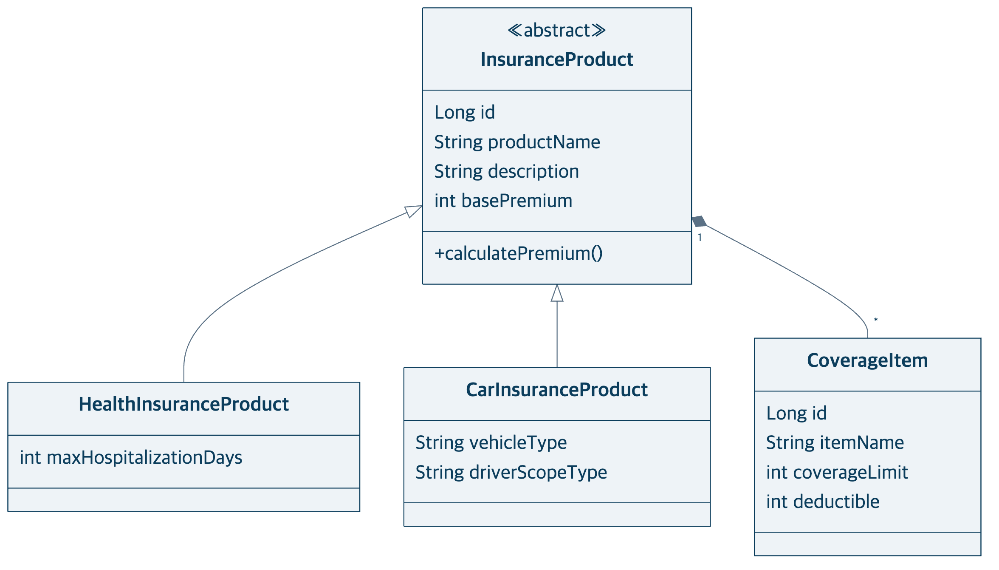</figure>
</div>

<div class="sd">
  <div class="same"><b>같은 점</b> 상품 상속과 CoverageItem 합성 관계가 동일.</div>
  <div class="diff"><b>다른 점</b> productId·itemId(String) → id(Long).</div>
</div>

---

## 설계 = 구현 — 계약

<div class="cmp2">
  <figure><span class="cap cap-d">내가 설계</span>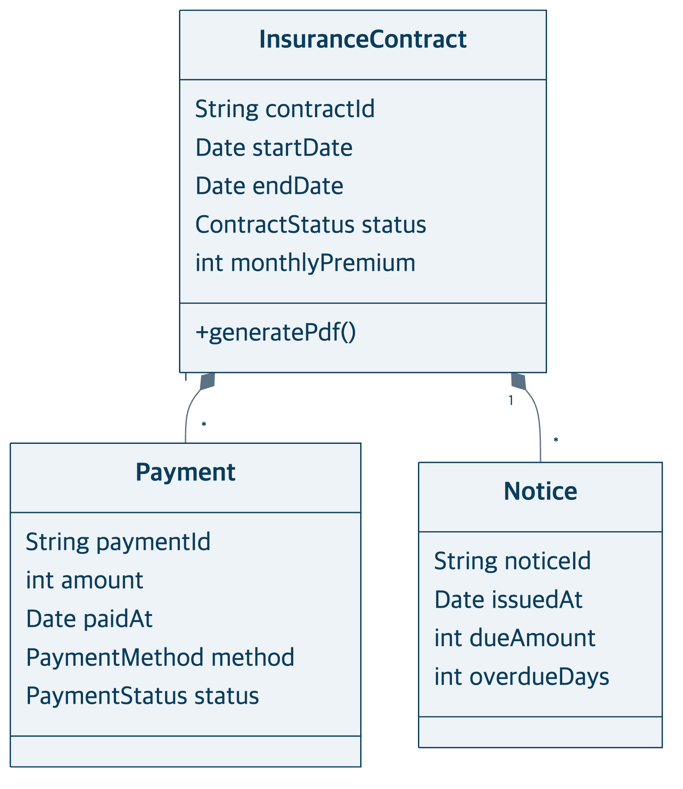</figure>
  <figure><span class="cap cap-b">코드 역설계</span>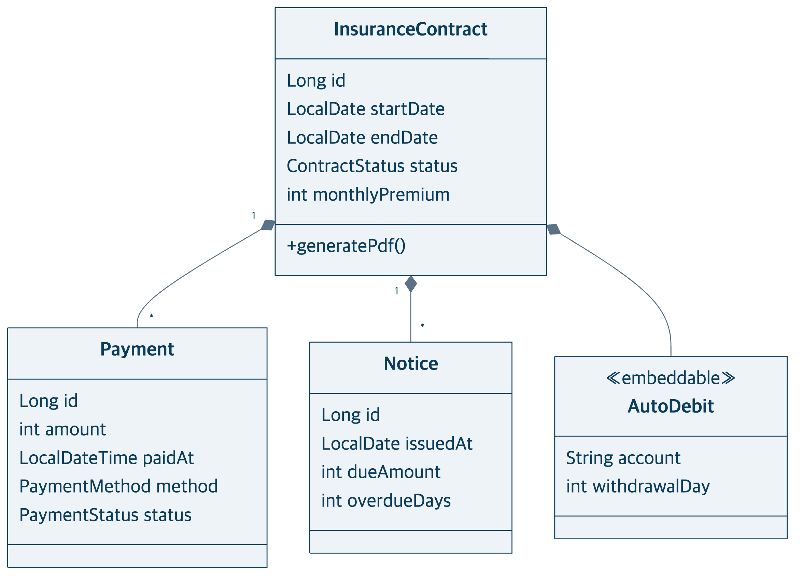</figure>
</div>

<div class="sd">
  <div class="same"><b>같은 점</b> 계약–납부–고지 합성 구조가 동일.</div>
  <div class="diff"><b>다른 점</b> 자동이체 정보 AutoDebit 추가, 날짜 타입 변경.</div>
</div>

---

## 설계 = 구현 — 청구

<div class="cmp2">
  <figure><span class="cap cap-d">내가 설계</span>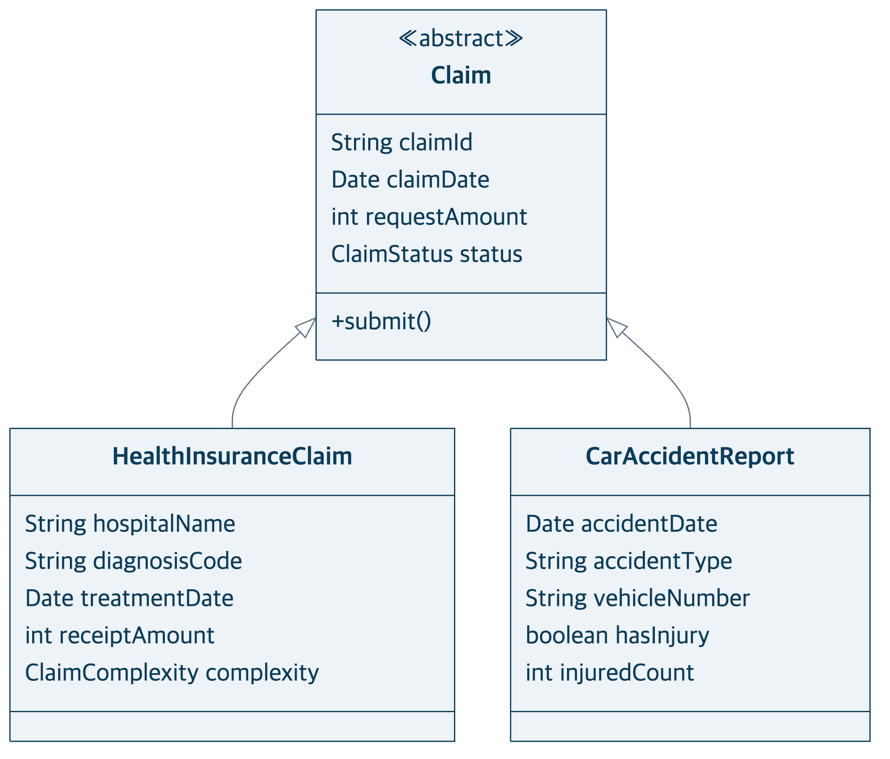</figure>
  <figure><span class="cap cap-b">코드 역설계</span>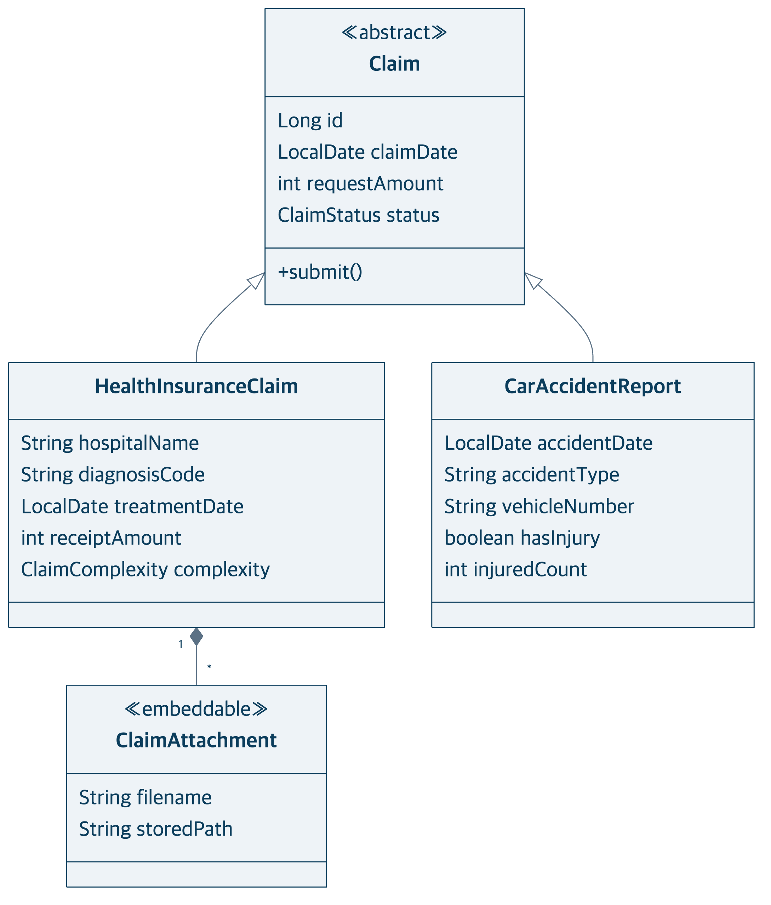</figure>
</div>

<div class="sd">
  <div class="same"><b>같은 점</b> Claim 상속(의료/자동차)과 필드가 동일.</div>
  <div class="diff"><b>다른 점</b> 첨부파일 ClaimAttachment 추가, ClaimStatus 4값 → 6값(송금 결과 추적).</div>
</div>

---

## 설계 = 구현 — 청구 상태값 (코드)

```java
public enum ClaimStatus {
    PENDING, IN_REVIEW, APPROVED, REJECTED,  // 설계 4값
    COMPLETED, FAILED                        // 구현 추가: 송금 성공·실패 (ADR 0007)
}
```

<p class="verdict">송금 결과까지 추적해야 해서 두 값을 더했습니다.</p>

---

## 설계 = 구현 — 심사

<div class="cmp2">
  <figure><span class="cap cap-d">내가 설계</span>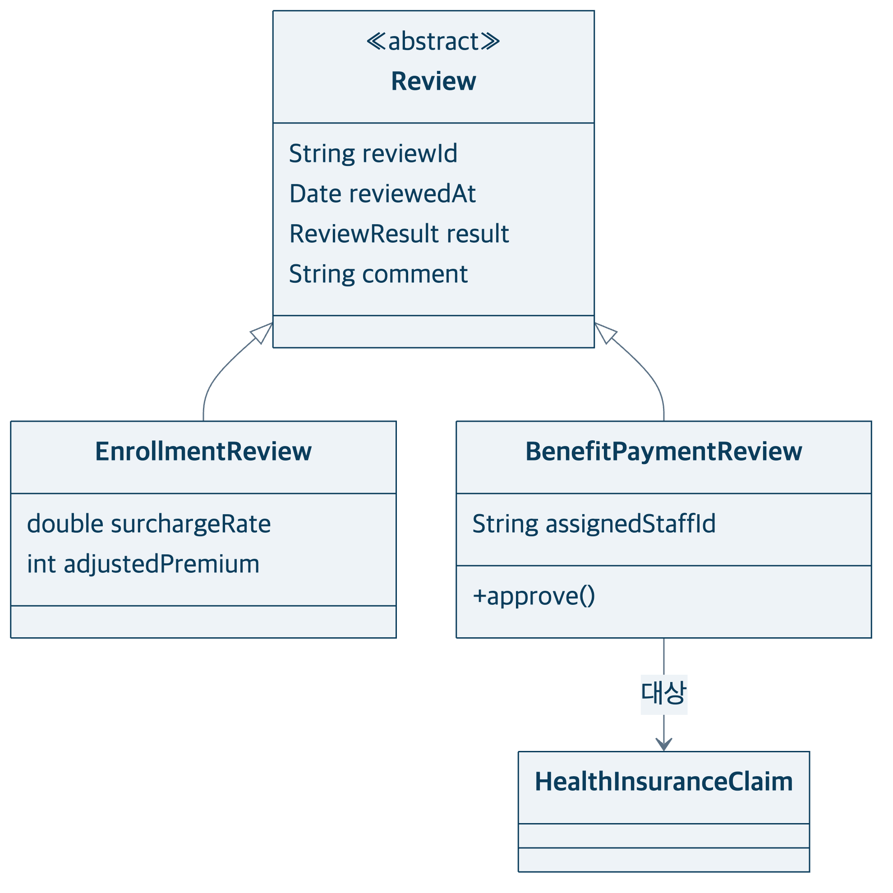</figure>
  <figure><span class="cap cap-b">코드 역설계</span>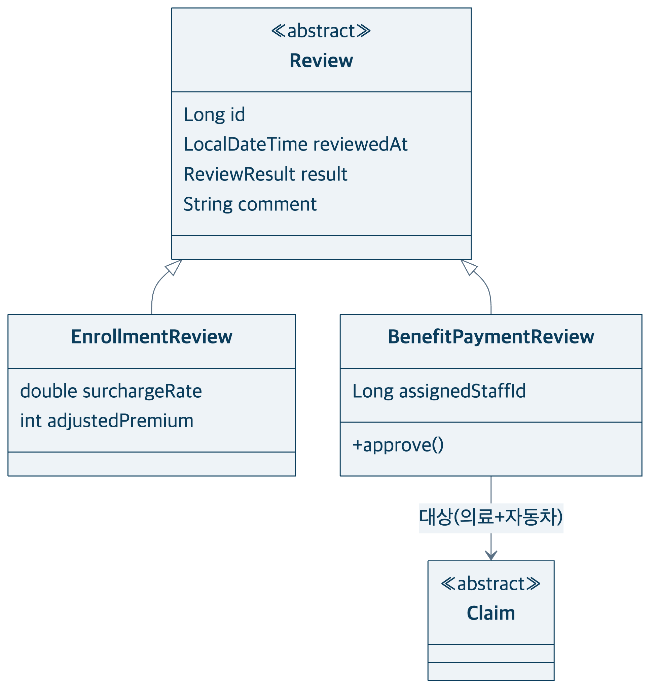</figure>
</div>

<div class="sd">
  <div class="same"><b>같은 점</b> Review 상속(가입심사/지급심사) 구조가 동일.</div>
  <div class="diff"><b>다른 점</b> 지급심사 대상이 의료청구 → Claim(의료+자동차)으로 확대 (ADR 0009).</div>
</div>

---

## 설계 = 구현 — 사고이력

<div class="cmp2">
  <figure><span class="cap cap-d">내가 설계</span>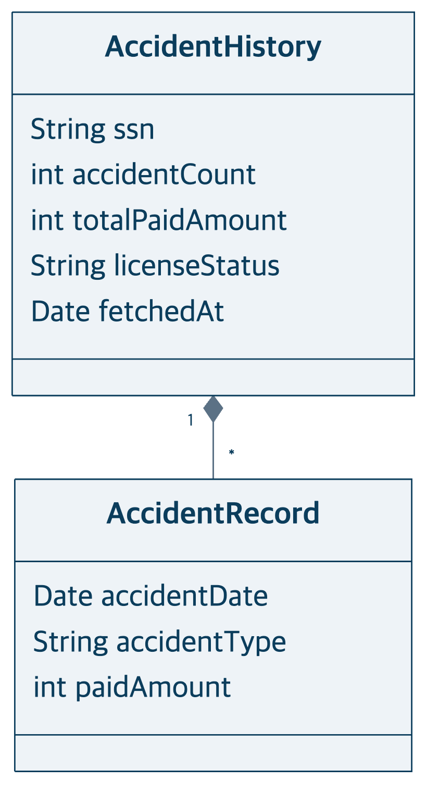</figure>
  <figure><span class="cap cap-b">코드 역설계</span>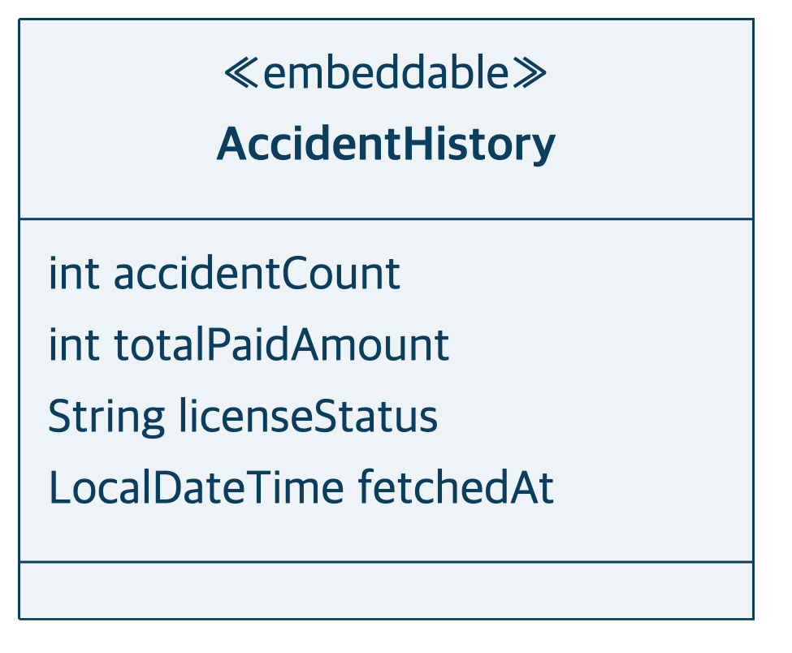</figure>
</div>

<div class="sd">
  <div class="same"><b>같은 점</b> 사고 집계 정보(건수·지급액·면허상태)를 동일하게 보유.</div>
  <div class="diff"><b>다른 점</b> 외부 연동이 더미라 개별 AccidentRecord 제거, 값 객체로 단순화.</div>
</div>

---

## 유스케이스도 설계대로 동작한다

<div style="text-align:center">
  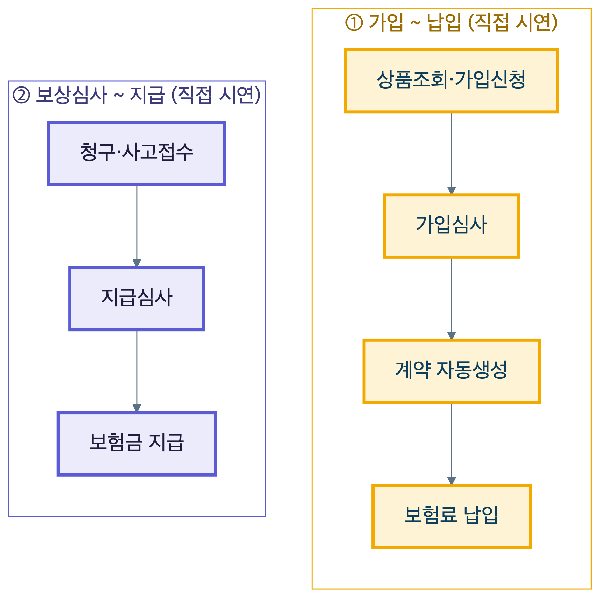
</div>

<p class="verdict">설계한 유스케이스가 데모에서 그대로 동작합니다 (노란 경로).</p>

---

## AI를 어떻게 썼는가

<div class="who">
  <div class="human"><b>사람(설계자)</b><br>다이어그램 설계 · 결정(ADR) · 리뷰</div>
  <div class="ai"><b>AI</b><br>구현 · 테스트 · 리팩토링</div>
</div>

<div class="aipipe">
  <div class="aistep"><b>설계</b><small>다이어그램</small></div>
  <div class="arrow">→</div>
  <div class="aistep"><b>취조</b><small>모델 대조</small></div>
  <div class="arrow">→</div>
  <div class="aistep"><b>계획</b></div>
  <div class="arrow">→</div>
  <div class="aistep tdd"><b>TDD 구현</b><small>AI</small></div>
  <div class="arrow">→</div>
  <div class="aistep"><b>리뷰</b></div>
</div>

<p class="verdict">설계와 결정은 사람이, 구현은 AI가 했습니다.</p>

---

## AI를 쓰며 생긴 문제와 해결

<div class="cards">
  <div class="card"><h3>① 성급한 추상화</h3><p class="fix">실익 없는 계층 분리 → 되돌림</p></div>
  <div class="card"><h3>② 명세와 불일치</h3><p class="fix">자동 배정 → 수동 배정으로 정정</p></div>
  <div class="card"><h3>③ 계층 패턴 일탈</h3><p class="fix">점검으로 식별·관리</p></div>
  <div class="card"><h3>④ 용어·도메인 오염</h3><p class="fix">용어집·ADR로 사전 차단</p></div>
</div>

<p class="verdict">AI는 빠르지만, 방향은 사람이 잡았습니다.</p>

---

<!-- _class: lead -->

# 결론

<br>

## 설계한 그대로 구현했고, 그 과정에서 AI를 통제했습니다.

<br>

감사합니다.
